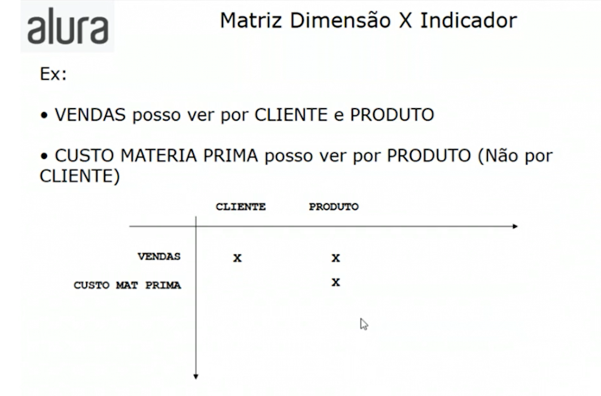

# Vantagens de um Datawarehouse
* Integração de diversas fontes;
* Implementação das regras de negócio;
* Limpeza de dados;
* Análise ao longo do tempo.

## Como projetar um Datawarehouse
---
1. O quero analisar?
   * Indicador / Medida ou Variável.
2. Como quero analisar?
   *  Dimensão

## Matriz Dimensão X Indicador
--- 
* Nas linhas:
    * Qual informação quero ver(Vendas, Custos, Lucro, etc...)
* Nas colunas:
  * Dimensão: Como quero ver a informação(Cliente, Empresa, Tempo, etc...)
---

---
Exemplo:
* Vendas posso ver por Cliente e Produto
* Custo materia prima posso ver por Produto(Não por Cliente)  
>**Obs. Conhecer o negócio para saber o que está fazendo**  
--- 

---
## Detalhe de uma dimensão

Uma dimensão é composta de hierarquia, as hierarquias são compostas por níveis e os níveis podem ou não possuir atributos.

### Relação entre as entidades da dimensão
>* Cliente
>* Cidade
>* Estado         
>* Segmento
>* Tamanho
>* Produto

Qual a relação entre estas entidades?  
1:1? 1:N? N:M?

---
