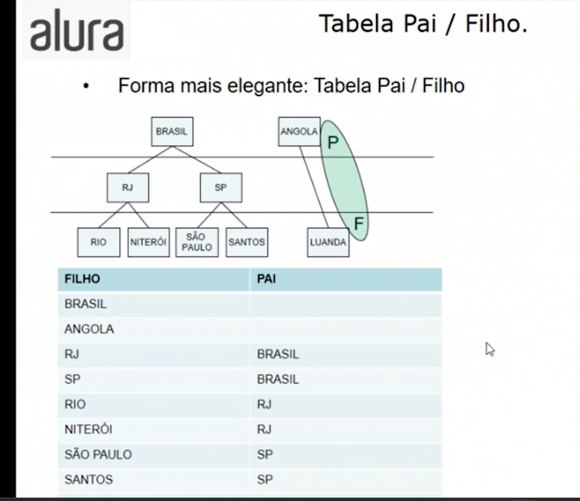
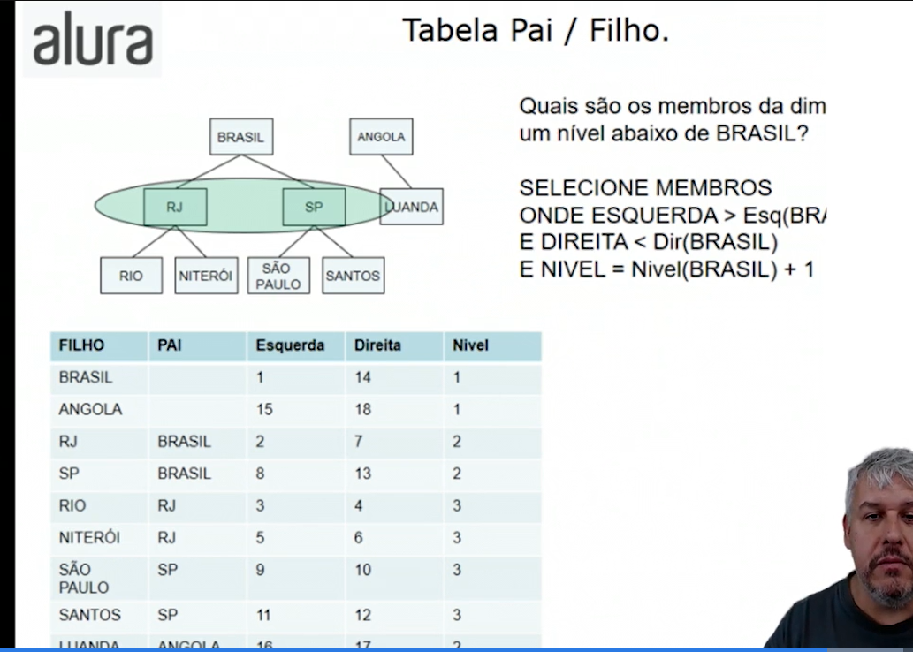
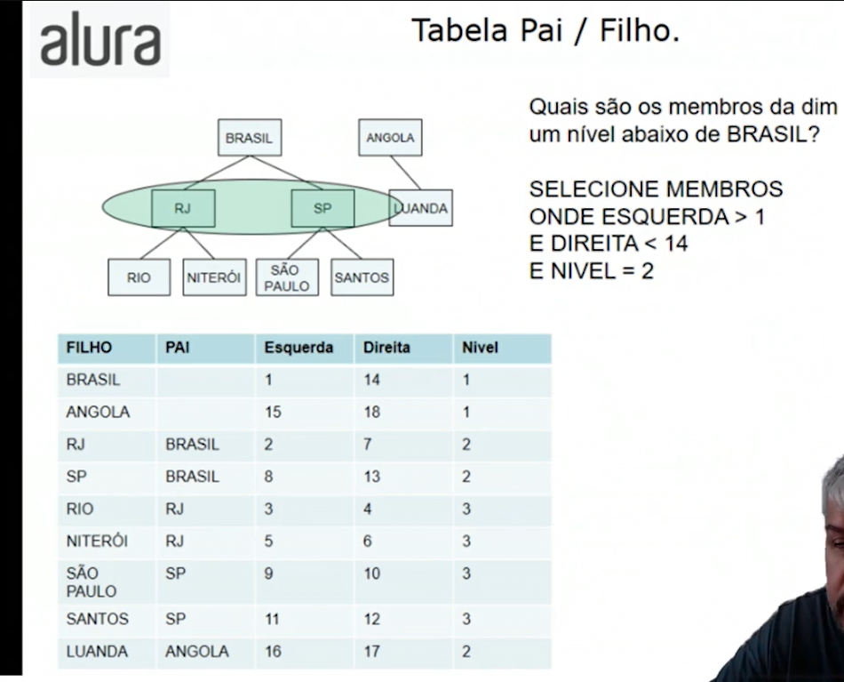

# Dimensão Irregular.
* Dimensão Cliente
* 1 Hierarquia -> Geográfica
* 3 Níveis: Cidade, Estado e País

* Dimensão irregular em um Modelo Estrela.

## Como resolver? 

Podemos criar um estado fictício que tenha por exemplo, o mesmo nome do país. Mas essa não é a maneira mais elegante.

# Tabela Pai / Filho.
* Forma mais elegante: Pai/Filho.

* Quando tempos uma dimensão irregular, numa tabela **Esquerda/Direita**, é desejável criar os atributos **Esquerda/Direita** e Nível.
* Os atributos **Esquerda/Direita** são inteiros que identificam cada membro da dimensão.
* O atributo nível identifica quantos níveis abaixo na hierarquia o membro da dimensão está localizado.
* Estes atributos auxiliam na localização de membros da dimensão

---

---
## Uso de Dimensões Irregulares
* O uso de dimensões irregulares é usado mais em dimensões onde não sabemos quantos núveis teremos e nem como serão as relações entre os seus membros.
* Um bom exemplo é o plano de contas contábil.

* 1.1 - Conta 1.1
    * 1.1.1 - Conta 1.1.1
    * 1.1.2 - Conta 1.1.2
      * 1.1.2.1 - Conta 1.1.2.1
        * 1.1.2.1.1 - Conta 1.1.2.1.1
      * 1.1.2.2 - Conta1.1.2.2
    * 1.1.3 - Conta 1.1.3
* 1.2 - Conta 1.2
  * 1.2.1 - Conta 1.2.1